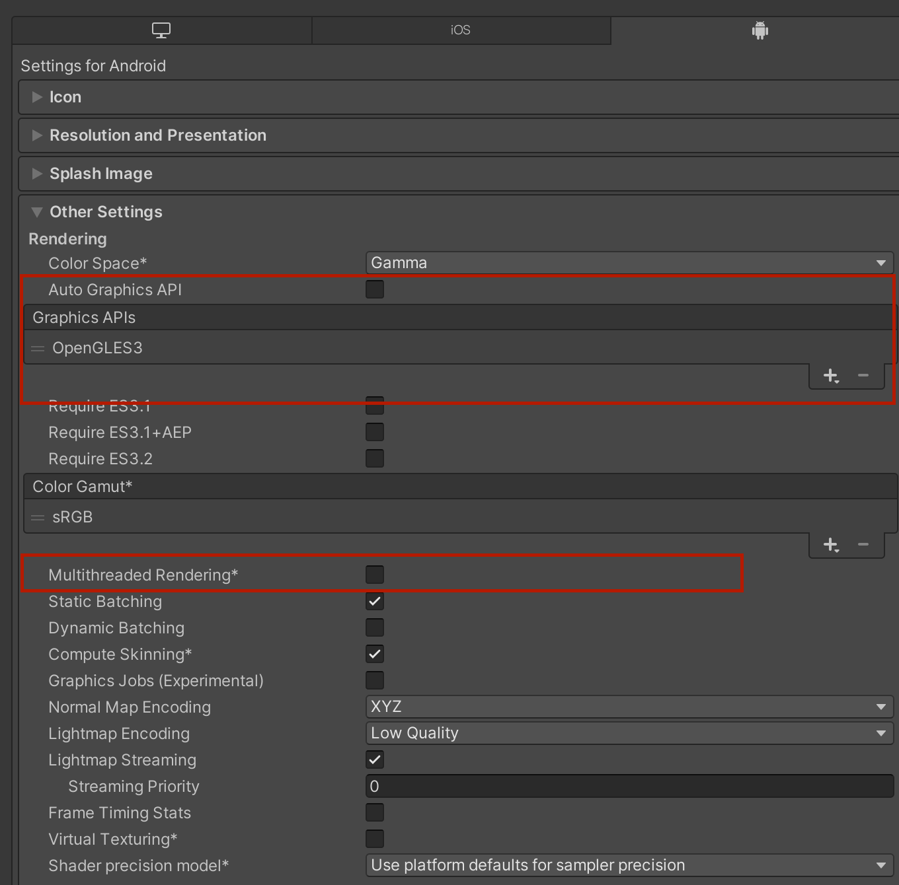
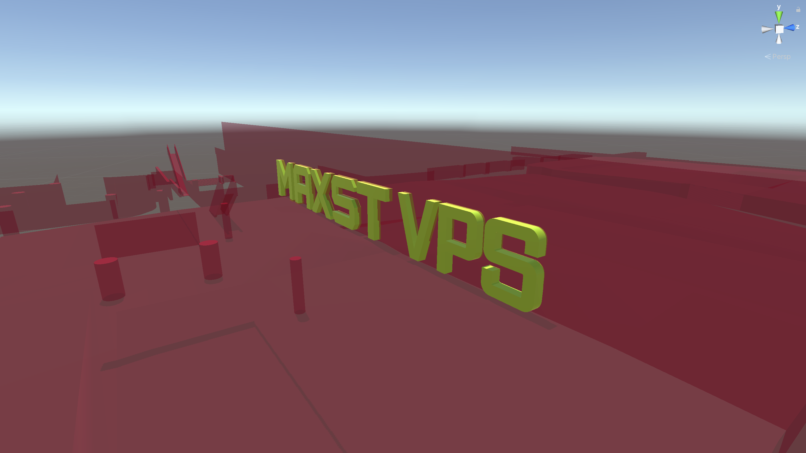
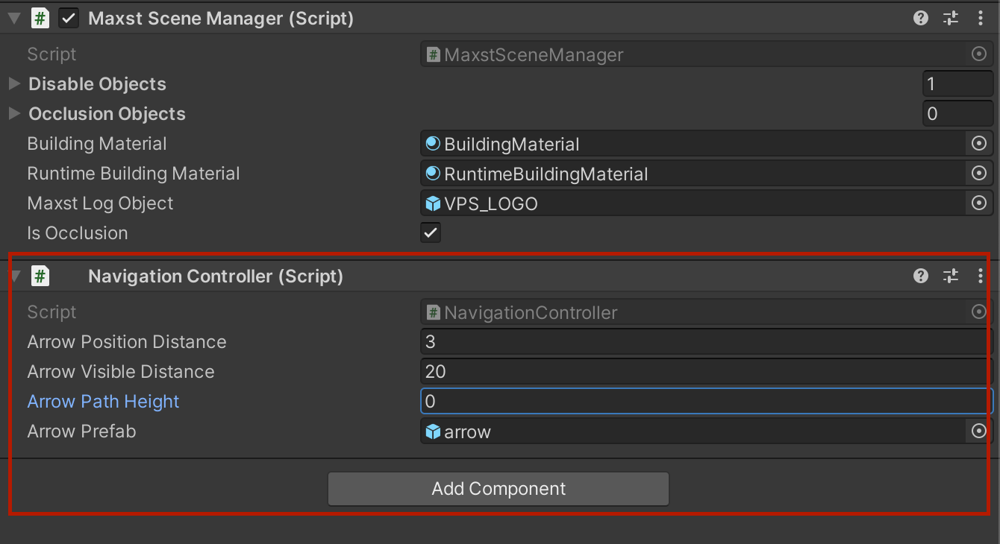

# 맥스트 VPS SDK 사용

## VPS 사용

Assets\MaxstAR\VPS\VPSStudio\Path\NavigationController.cs(5,13): error CS0234: The type or namespace name ‘EditorCoroutines’ does not exist in the namespace ‘Unity’ 관련 에러가 나올 때는 Window->PackageManager->Editor Coroutines을 검색하여 패키지를 설치합니다.


## Project Setting

- Unity Project Setting에서 Android는 Graphics API를 OpenGLES3 만 지원합니다.
- Multithreaded Rendering은 unCheck 되어야 합니다.



------

## VPS 필수 파일 설치

VPSData_(xxx).zip를 Project Folder 와 동일한 폴더에 풉니다. Unity(Project Name)/../VPSData/VPSSimulationData 이런식의 구조가 되어야 합니다.


------

##  사용 방법

-  Asset/Scene/Scenes/MaxstScene.unity을 선택합니다. 

* Hierarchy에서 VPSStudio를 선택합니다.
* VPS Map에서 시뮬레이션을 할 맵을 선택합니다.
* VPS Simulation Data에서 사용하고 싶은 시뮬레이션 데이터를 선택합니다.(다른 데이터를 선택하시면 다른 시뮬레이팅된 화면이 나타납니다.)
* Load VPS Map을 클릭해서 해당 맵에 대한 정보를 불러옵니다.
* VPS 맵이 생성 되고 카메라가 표시됩니다.


------

## 저작 방법

- Hierarchy에 Trackable 하위에 장소의 메쉬 컨텐츠가 존재합니다.
- 각 장소에 맞는 Trackable 하위에 컨텐츠를 배치하여야 제대로 인식이 가능 합니다.**(각 장소의 이름은 메쉬와 Trackable 속성에 있습니다.)**
- 각각의 Trackable 하위 GameObject의 Position을 변경하여 재배치 하면 됩니다,
- 재배치된 컨텐츠를 Play버튼을 누르면 시뮬레이터 데이터가 로드 되면서 컨텐츠가 실제 화면에서 어떻게 증강 되는지 보여지게 됩니다.
- 인식 위치에 따라서 각각의 Trackable이 **Active**되게 됩니다.




------

## ReferenceCamera 이용 방법.

VPSStudio에서 해당 VPS Map을 선택하고 Load VPS Map을 클릭하면 맵의 학습 시점의 카메라가 VPSStudio하위에 생성 됩니다.


하위에 생성된 카메라 그룹을 선택하거나 Game View에서 카메라를 선택하고 하위의 ReferenceCamera를 선택하면 Game View에 학습 시점에 이미지와 함께 컨텐츠가 어떻게 배치 되는지 확인 할 수 있습니다.


해당 위치의 Trackable 하위에 컨텐츠를 배치하고 위치를 이동 시키면서 실제 배치가 어떻게 될지 확인 합니다.

------

## Occlusion 기능

- Occlusion 기능을 사용하고 싶으시면, Hierarchy에서 SceneManager에 Occlusion Objects에 컨텐츠를 추가하면 됩니다. Occlusion Objects 컨텐츠는 런타임 시점에 모두 투명 처리가 되는 Material로 변경 됩니다.
- Occlusion 기능 실행하고 싶지 않으시면, SceneManager에 IsOcclusion을 uncheck하면 됩니다. 다만 Occlusion을 적용하지 않으면 해당 위치의 Mesh가 보여지게 됩니다.

------

## 네비게이션 기능

- 네비게이션은 SceneManager GameObject에 포함되어 있습니다. 화살표의 거리, 화살표가 보이는 거리, 화살표의 기본 높이, 화살표의 prefab이 속성입니다. 화살표 prefab은 변경 가능 합니다.



- NavigationController의 MakePath 함수를 사용해서 네비게이션 경로가 생성 됩니다. 

```c#
MakePath(string start_location, Vector3 start_position, string end_location, Vector3 end_position, VPSTrackable[] trackables, string serverName = "")
```

- start_location : 현재 Trackable의 위치 입니다.
- start_position : 현재 Trackable의 위치의 3차원 좌표 입니다. 기본적으로 ARCamera의 position 좌표를 사용합니다.
- end_location : 목적지의 Trackable의 위치 입니다. 코엑스에서는 1층, 지하1층, 지하 2층, 실외로 지정됩니다.
- end_position : 목적지의 3차원 좌표 입니다. 해당 목적지의 위치와 좌표가 맞아야 합니다.
- serverName : 네비게이션을 찾기위한 서버를 지정해야할 경우 사용합니다.

------

## 주의사항

- MacOS에서 작업하실경우 현재 Unity에서 Nortarization을 제공하지 않아 플러그인이 제대로 작동하지 않습니다. 아래의 명령으로 GateKeeper를 해제 하셔야합니다.

```
cd Assets/MaxstAR/Plugins

xattr -cr MaxstAR.bundle

sudo spctl —master-disable
```

- Android에서는 카메라와 위치 권한이 필요합니다. AndroidManifest.xml를 참고하시길 바랍니다.  Android OS 8(오레오) 이상이면 해당 프로젝트에서 안드로이드 퍼미션을 얻으셔야합니다. 현재는 아래의 코드로 권한을 얻습니다.

```c#
AndroidRuntimePermissions.Permission[] result = AndroidRuntimePermissions.RequestPermissions("android.permission.WRITE_EXTERNAL_STORAGE", "android.permission.CAMERA", "android.permission.ACCESS_FINE_LOCATION", "android.permission.ACCESS_COARSE_LOCATION");
```

-  https문제로 AndroidManifest.xml에 아래 코드를 추가하셔야 합니다.

  ```
  android:usesCleartextTraffic=“true” 
  ```

- iOS에서도 또한 위치와 카메라 권한을 요구합니다.

  Info.plist에 Privacy - Location에 관련된 권한을 모두 얻어야합니다.**(Location 권한을 얻지 못하면 GPS 좌표를 얻지 못합니다.)**

- **인식에는 인터넷이 필요합니다.** SDK가 빌드된 폰에 인터넷이 작동하는지 확인해 주세요.

------

## VPS시작

VPS SDK는 카메라와 TrackerManager의 시작이 있어야 작동이 됩니다.

```c#
if (Application.platform == RuntimePlatform.OSXEditor || Application.platform == RuntimePlatform.WindowsEditor)
{
    string simulatePath = vPSStudioController.vpsSimulatePath;
    if (Directory.Exists(simulatePath))
    {
        CameraDevice.GetInstance().Start(simulatePath);
        MaxstAR.SetScreenOrientation((int)ScreenOrientation.Portrait);
    }
}
else
{
    if (CameraDevice.GetInstance().IsFusionSupported(CameraDevice.FusionType.ARCamera))
    {
        CameraDevice.GetInstance().Start();
    }
    else
    {
        TrackerManager.GetInstance().RequestARCoreApk();
    }
}

TrackerManager.GetInstance().StartTracker();
}
```

카메라를 시작하는 코드는 아래와 같습니다.

```c#
CameraDevice.GetInstance().Start();
```

시뮬레이션 카메라를 시작하는 코드는 아래와 같습니다. 시뮬레이션 카메라는 VPSCollector를 기반으로 만들어진 데이터의 위치를 Path로 전달해 주어야 합니다.

```c#
CameraDevice.GetInstance().Start(simulatePath);
```

VPS의 엔진을 시작하는 코드는 아래와 같습니다.

```c#
TrackerManager.GetInstance().StartTracker();
```

------

## VPS 데이터 갱신

VPS에 대한 결과물은 Update 함수에서 갱신이 됩니다. openGL thread를 이용하려는 목적이 있습니다.

```c#
TrackerManager.GetInstance().UpdateFrame();
```

UpdateFrame 함수를 통해서 카메라의 포지션과 VPS에 관련된 데이터를 ARFrame에 저장합니다.

### ARFrame

ARFrame 클래스는 VPS의 인식으로 인해 얻어진 데이터를 담고 있습니다.

- GetTrackedImage() 를 통해서 이미지를 얻어내게 됩니다. 
- GetARLocationRecognitionState() 를 통해서 인식 상태를 얻어냅니다. 
- GetARTrackingState() 를 통해서 ARCore, ARKit의 트래킹 상태 여부를 얻습니다.
- GetARTrackingFailureReason() 를 통해서 ARCore, ARKit이 작동 되지 않는 이유를 얻을 수 있습니다.
- GetTransform() 를 통해서 인식이 완료된 카메라의 위치를 얻을 수 있습니다.
- GetARLocalizerLocation()를 통해서 시뮬레이션 영상이나, 카메라 이미지로 얻어진 인식 위치를 전달합니다.

### 인식과 Trackable

```c#
if(arFrame.GetARLocationRecognitionState() == ARLocationRecognitionState.ARLocationRecognitionStateNormal)
{
    Matrix4x4 targetPose = arFrame.GetTransform();

    arCamera.transform.position = MatrixUtils.PositionFromMatrix(targetPose);
    arCamera.transform.rotation = MatrixUtils.QuaternionFromMatrix(targetPose);
    arCamera.transform.localScale = MatrixUtils.ScaleFromMatrix(targetPose);

    string localizerLocation = arFrame.GetARLocalizerLocation();

    if (currentLocalizerLocation != localizerLocation)
    {
        currentLocalizerLocation = localizerLocation;
        foreach (VPSTrackable eachTrackable in vPSTrackablesList)
        {
            bool isLocationInclude = false;
            foreach(string eachLocation in eachTrackable.localizerLocation)
            {
                if(currentLocalizerLocation == eachLocation)
                {
                    isLocationInclude = true;
                    break;
                }
            }
            eachTrackable.gameObject.SetActive(isLocationInclude);
        }
    }
}
```

위의 코드는 인식이 완료된 시점에 카메라의 position과 rotation을 적용하는 방법이 있습니다.

인식된 위치를 통해서 해당 VPSTrackable을 선택하여 관련된 컨텐츠를 Active상태로 변경 합니다.

### Navigation

네비게이션 관련된 코드는 아래와 같습니다.

```c#
NavigationController navigationController = vPSStudioController.GetComponent<NavigationController>();
if(currentLocalizerLocation != null)
{
    navigationController.MakePath(currentLocalizerLocation, arCamera.transform.position, "landmark_coex_f1", new Vector3(9.723813f, 0, 102.732927f), vPSTrackablesList.ToArray(),
        ()=> {
            Debug.Log("No Path");
    });
}
```

VPSStudio에서 NavigationController를 얻어내서 사용합니다.

NavigationController는 현재 위치를 판단된 상태에서 사용할 수 있습니다. MakePath를 통해서 길을 만들어 냅니다. 길에 대한 정보가 없을 경우 "No Path"라는 로그를 전달 합니다.

MakePath 함수는 아래와 같습니다.

```c#
public void MakePath(string start_location, Vector3 start_position, string end_location, Vector3 end_position, VPSTrackable[] trackables, Action fail, string serverName = "")
```

네비게이션을 실행 할때는 시작위치와 끝나는 위치 이름과 position을 전달해야 합니다. 


------

## VPSSDK 최적화 방법

1. Camera의 Clipping Planes Near와 Far를 조절합니다.

AbstractARManager.cs

```c#
void OnPreRender()
{
    if (screenWidth != Screen.width || screenHeight != Screen.height)
    {
        screenWidth = Screen.width;
        screenHeight = Screen.height;
        MaxstAR.OnSurfaceChanged(screenWidth, screenHeight);
    }

    if (orientation != Screen.orientation)
    {
        orientation = Screen.orientation;

        if (Application.platform == RuntimePlatform.Android ||
            Application.platform == RuntimePlatform.IPhonePlayer)
        {
            MaxstAR.SetScreenOrientation((int)orientation);
        }
    }

    if (nearClipPlane != arCamera.nearClipPlane || farClipPlane != arCamera.farClipPlane)
    {
        nearClipPlane = arCamera.nearClipPlane;
        farClipPlane = arCamera.farClipPlane;
        CameraDevice.GetInstance().SetClippingPlane(arCamera.nearClipPlane, arCamera.farClipPlane);
    }

    arCamera.projectionMatrix = CameraDevice.GetInstance().GetProjectionMatrix();
}
```

```c#
CameraDevice.GetInstance().SetClippingPlane(arCamera.nearClipPlane, arCamera.farClipPlane);
```

을 통해서 Near와 Far를 조절합니다.
